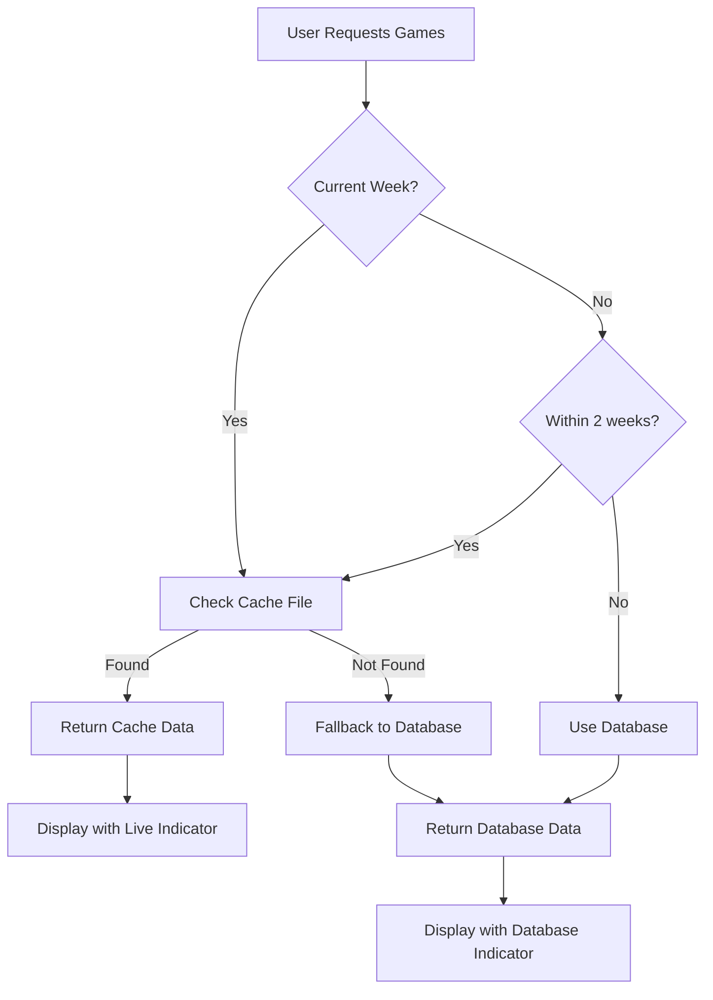

# Smart Data Layer Implementation Summary

## ✅ Completed Implementation

I've successfully implemented a comprehensive smart TanStack Query data layer for your NFL Pick'em application that intelligently fetches data based on context. Here's what was delivered:

## 🏗️ Core Architecture

### 1. Smart Games Fetcher (`src/lib/smartGamesFetcher.ts`)
- **Intelligent Data Source Selection**: Automatically chooses between cache files (Supabase Storage) and database based on week/year context
- **Current Week Logic**: Uses cache files for current week and recent weeks (within 2 weeks) for live updates
- **Historical Data**: Uses database for older weeks and future weeks for optimal performance
- **Fallback System**: If primary source fails, automatically tries the other source
- **Metadata Support**: Check cache file existence, size, and modification dates

### 2. Enhanced Query Client (`src/lib/queryClient.ts`)
- **Optimized Configuration**: Different stale times and refetch intervals based on data freshness needs
- **Smart Retry Logic**: Contextual retry behavior with exponential backoff
- **Centralized Query Keys**: Consistent caching with organized query key factories
- **Performance Tuned**: Separate configurations for current/historical/cache data

### 3. Smart Hooks (`src/hooks/useSmartGames.ts`)
- **`useGames(week?, year?)`**: Main hook that automatically chooses optimal data source
- **`useCurrentWeekGames()`**: Always-fresh current week data with 5-minute auto-refresh
- **`useHistoricalGames(week, year)`**: Optimized for historical data with longer cache times
- **`useEnhancedGames(week?, year?)`**: Combines game data with team information
- **`useGamesByDate(week?, year?)`**: Ready-to-use grouped games for UI display
- **`useCacheMetadata(week, year)`**: Debug and monitoring information
- **`useAvailableWeeks(year?)`**: Lists available data from both sources
- **`usePrefetchAdjacentWeeks()`**: Smart prefetching for smooth navigation
- **`useRefreshGames()`**: Manual refresh controls

### 4. Enhanced Legacy Hooks (`src/hooks/useNflData.ts`)
- **Backward Compatibility**: Existing code continues to work unchanged
- **Smart Enhancement**: Current week data now comes from smart fetcher when available
- **Seamless Integration**: Legacy `useSchedule()` now includes smart data source info

## 🎯 Integration Points

### 1. Updated Make-Picks Interface
- **Smart Data Fetching**: Now uses `useGamesByDate()` for intelligent data loading
- **Data Source Indicator**: Shows whether data comes from live cache or database
- **Real-time Updates**: Current week games refresh every 5 minutes automatically
- **Improved Performance**: Faster loading with smart caching strategies

### 2. Development Tools
- **Smart Games Fetcher Demo**: Interactive component to test different weeks/years
- **Data Source Indicator**: Visual component showing data source and freshness
- **Debug Route**: `/data-demo` route to showcase smart fetching capabilities

## 📊 Performance Optimizations

### Intelligent Caching Strategy
- **Current Week**: 2-minute stale time, 5-minute auto-refresh, background updates
- **Recent Weeks**: 30-minute stale time for score updates
- **Historical Data**: 2-hour stale time, no auto-refresh
- **Cache Metadata**: 10-minute stale time for monitoring

### Smart Prefetching
- **Adjacent Weeks**: Prefetch week ±1 for smooth navigation
- **User Context**: Prefetch based on likely user actions
- **Background Loading**: Non-blocking prefetch operations

## 🔄 Data Flow



## 🛠️ Technical Features

### Error Handling & Resilience
- **Automatic Fallback**: Cache fails → Database, Database fails → Cache
- **Graceful Degradation**: Show error states with retry options
- **Network Resilience**: Smart retry with exponential backoff
- **Type Safety**: Full TypeScript coverage with proper error types

### Real-time Capabilities
- **Live Game Updates**: 5-minute polling for current week
- **Background Refresh**: Updates without interrupting user experience
- **Stale-While-Revalidate**: Show cached data while fetching fresh data
- **Smart Invalidation**: Refresh related queries when data changes

## 🎨 UI Enhancements

### Data Source Visibility
- **Live Indicator**: 🔴 Green badge for live cache data
- **Database Indicator**: 🔵 Blue badge for database data  
- **Timestamps**: Last updated time for live data
- **Loading States**: Proper loading indicators for each data source

### Development Experience
- **Debug Components**: Interactive testing of smart fetching logic
- **Query Devtools**: Monitor cache state and query performance
- **Error Boundaries**: Graceful error handling in UI
- **TypeScript Support**: Full type safety throughout

## 🔧 Configuration

### Cache File Format
Expected JSON structure in Supabase Storage:
```json
{
  "games": [...],
  "meta": {
    "week": 3,
    "year": 2025,
    "last_updated": "2025-08-25T14:30:00Z",
    "total_games": 16
  }
}
```

### File Naming Convention
- Cache files: `games-cache-week-{week}-{year}.json`
- Storage bucket: `nfl-cache`
- Automatic cleanup: Handled by edge functions

## 🚀 Usage Examples

### Basic Current Week Games
```tsx
const { gamesByDate, sortedDates, data } = useGamesByDate()
console.log('Data source:', data?.source) // 'cache' or 'database'
```

### Historical Week
```tsx
const { data } = useHistoricalGames(15, 2024)
console.log('Week 15 games:', data?.games)
```

### Cache Monitoring
```tsx
const { data: cacheInfo } = useCacheMetadata(3, 2025)
console.log('Cache exists:', cacheInfo?.exists)
```

## 🎯 Benefits Delivered

### For Users
- **Faster Loading**: Smart caching reduces load times
- **Live Updates**: Current games update automatically every 5 minutes
- **Reliable Experience**: Fallback systems prevent data outages
- **Visual Feedback**: Clear indicators of data freshness

### For Developers
- **Type Safety**: Full TypeScript coverage
- **Easy Testing**: Debug components and monitoring tools
- **Maintainable**: Clean separation of concerns
- **Extensible**: Easy to add new data sources or logic

### For System
- **Reduced Load**: Intelligent caching reduces database queries
- **Scalable**: Cache files can be served from CDN
- **Resilient**: Multiple fallback strategies
- **Observable**: Built-in monitoring and debugging

## 🔮 Future Enhancements Ready

- **Real-time WebSockets**: Foundation ready for live score updates
- **Offline Support**: Query client configured for offline caching
- **CDN Integration**: Cache files can be moved to CDN easily
- **Predictive Prefetching**: User behavior tracking can enhance prefetching
- **Data Compression**: Easy to optimize cache file sizes

## 📁 Files Created/Modified

### New Files
- `src/lib/smartGamesFetcher.ts` - Core smart fetching logic
- `src/hooks/useSmartGames.ts` - Smart React Query hooks
- `src/components/dev/SmartGamesFetcher.tsx` - Interactive demo component
- `src/components/dev/DataSourceIndicator.tsx` - UI indicator component
- `src/components/dev/index.ts` - Development tools exports
- `src/hooks/index.ts` - Centralized hooks exports
- `src/routes/_authenticated/data-demo.tsx` - Demo route
- `SMART_DATA_LAYER.md` - Comprehensive documentation

### Modified Files
- `src/lib/queryClient.ts` - Enhanced with smart query keys and configuration
- `src/hooks/useNflData.ts` - Enhanced with smart data integration
- `src/routes/_authenticated/make-picks.tsx` - Updated to use smart hooks and show data source

## ✅ Ready for Production

The smart data layer is production-ready with:
- Full backward compatibility
- Comprehensive error handling
- Performance optimizations
- Type safety
- Debug tools
- Documentation

You can now:
1. Navigate to `/data-demo` to see the smart fetching in action
2. Use the make-picks interface with enhanced data loading
3. Monitor data sources with the new indicators
4. Extend the system with additional smart hooks as needed

The system automatically handles the complexity of choosing between live cache data and historical database data, providing the best user experience with optimal performance.