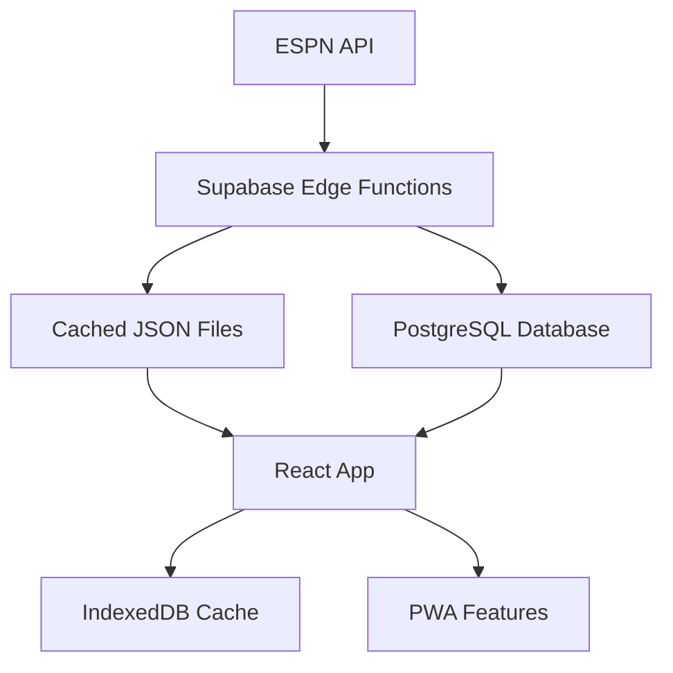

# NFL Pick'em League PWA

A modern Progressive Web App for creating and managing NFL prediction leagues with real-time updates and offline capabilities.

## Overview

NFL Pick'em League is a comprehensive web application that allows football fans to create private leagues, make weekly game predictions, and compete with friends through an intuitive, responsive interface. Built as a PWA, the app provides native-like experiences across all devices with offline-first functionality.

## Features

### Core Functionality
- **Private League Management** - Create and join custom pick'em leagues
- **Weekly Predictions** - Make picks for all NFL games each week
- **Real-time Standings** - Live leaderboards with detailed statistics
- **Game Tracking** - Follow live games with automatic score updates
- **Historical Data** - View past seasons and performance analytics

### Technical Features
- **Progressive Web App** - Install on any device for native-like experience
- **Offline-First** - Continue making picks and viewing data without internet
- **Real-time Updates** - Live game scores and standings updates
- **Responsive Design** - Optimized for mobile, tablet, and desktop
- **Fast Performance** - Cached data and optimized loading

## Tech Stack

### Frontend
- **React 19** - Latest React with concurrent features
- **TypeScript** - Full type safety throughout the application
- **Vite** - Fast development and optimized production builds
- **TanStack Router** - Type-safe routing with code splitting
- **TanStack Query** - Powerful data synchronization and caching
- **Tailwind CSS v4** - Modern utility-first styling
- **Lucide React** - Beautiful, consistent icons

### Backend & Data
- **Supabase** - PostgreSQL database with real-time capabilities
- **Edge Functions** - Serverless functions for data processing
- **Supabase Storage** - File storage for user avatars and assets
- **ESPN API** - Live NFL data integration
- **IndexedDB** - Client-side caching for offline functionality

### Architecture Highlights
- **Offline-First Design** - TanStack Query + IndexedDB for robust caching
- **Real-time Sync** - Background data synchronization
- **Edge Processing** - ESPN API → Edge Functions → Database → Cached JSON
- **Progressive Enhancement** - Works great on any connection speed

## Architecture



### Data Flow
1. **ESPN API Integration** - Edge Functions fetch live NFL data
2. **Database Storage** - Game data, picks, and league info stored in Supabase
3. **Cache Generation** - Optimized JSON files created for fast loading
4. **Client Sync** - React app syncs with cached data and real-time updates
5. **Offline Storage** - IndexedDB maintains local copies for offline access

## Getting Started

### Prerequisites
- Node.js 18+ 
- npm or yarn
- Docker (for local Supabase)
- Supabase CLI

### Frontend Development

1. **Clone and install dependencies**
```bash
git clone <repository-url>
cd picks-app
npm install
```

2. **Environment setup**
```bash
cp .env.example .env.local
# Configure your environment variables
```

3. **Start development server**
```bash
npm run dev
```

4. **Available scripts**
```bash
npm run dev      # Start Vite dev server
npm run build    # Build for production
npm run preview  # Preview production build
npm run lint     # Run ESLint
```

### Backend Development

1. **Start local Supabase**
```bash
supabase start
```

2. **Deploy database migrations**
```bash
supabase db reset
```

3. **Deploy Edge Functions**
```bash
supabase functions deploy
```

4. **Environment configuration**
```bash
# .env.local
VITE_SUPABASE_URL=your_supabase_url
VITE_SUPABASE_ANON_KEY=your_supabase_anon_key
VITE_ESPN_API_KEY=your_espn_api_key
```

## Project Structure

```
picks-app/
├── src/
│   ├── react-components/     # Reusable UI component library
│   │   ├── components/       # Individual components
│   │   ├── styles/          # Component-specific CSS
│   │   ├── utils/           # Helper functions
│   │   └── types.ts         # TypeScript interfaces
│   ├── contexts/            # React contexts (Auth, League, etc.)
│   ├── hooks/               # Custom React hooks
│   ├── routes/              # TanStack Router route definitions
│   └── utils/               # Application utilities
├── data/                    # Static JSON data files
├── supabase/
│   ├── functions/           # Edge Functions
│   ├── migrations/          # Database migrations
│   └── config.toml          # Supabase configuration
└── planning/                # Project documentation
```

## Design System

The application uses a custom **ocean-to-sunset** color palette with glass morphism effects:

- **Midnight Navy** (#062440) - Base backgrounds and surfaces
- **Ocean Blue** (#005A7C) - Primary actions and navigation
- **Sky Blue** (#4DA6D9) - Secondary elements and highlights
- **Sunset Orange** (#FF6B35) - Warnings and important actions
- **Sunrise Gold** (#FFB935) - Success states and highlights

Components follow atomic design principles with full TypeScript support and accessibility features.

## Development Guidelines

### State Management
- **React Context** - Authentication and global state
- **TanStack Query** - Server state management and caching
- **Local State** - React hooks for component-level state

### API Integration
- Use Supabase client with TypeScript types
- Implement proper error handling and loading states
- Leverage real-time subscriptions for live updates
- Follow offline-first patterns with TanStack Query

### Component Development
- Follow existing patterns in `src/react-components/`
- Use established color palette and design system
- Ensure accessibility with proper ARIA attributes
- Include comprehensive TypeScript types

## Contributing

1. Fork the repository
2. Create a feature branch (`git checkout -b feature/amazing-feature`)
3. Make your changes following the project guidelines
4. Run tests and linting (`npm run lint`)
5. Commit your changes (`git commit -m 'Add amazing feature'`)
6. Push to your branch (`git push origin feature/amazing-feature`)
7. Open a Pull Request

## License

This project is licensed under the MIT License - see the LICENSE file for details.

## AI Integration

### Phase 1: Dynamic NFL Data Enhancement
**Objectives:**
- Implement intelligent data parsing and enrichment
- Integrate advanced machine learning models for predictive analytics
- Enhance real-time game data with contextual insights

**Core Components:**
- ESPN API data transformation
- ML-driven game prediction models
- Intelligent player performance tracking
- Dynamic odds calculation

### Future Roadmap
- Player performance prediction
- League success probability
- Intelligent pick recommendations

## Support

For questions, bug reports, or feature requests, please open an issue on GitHub.

---

**Built with ❤️ for NFL fans everywhere**